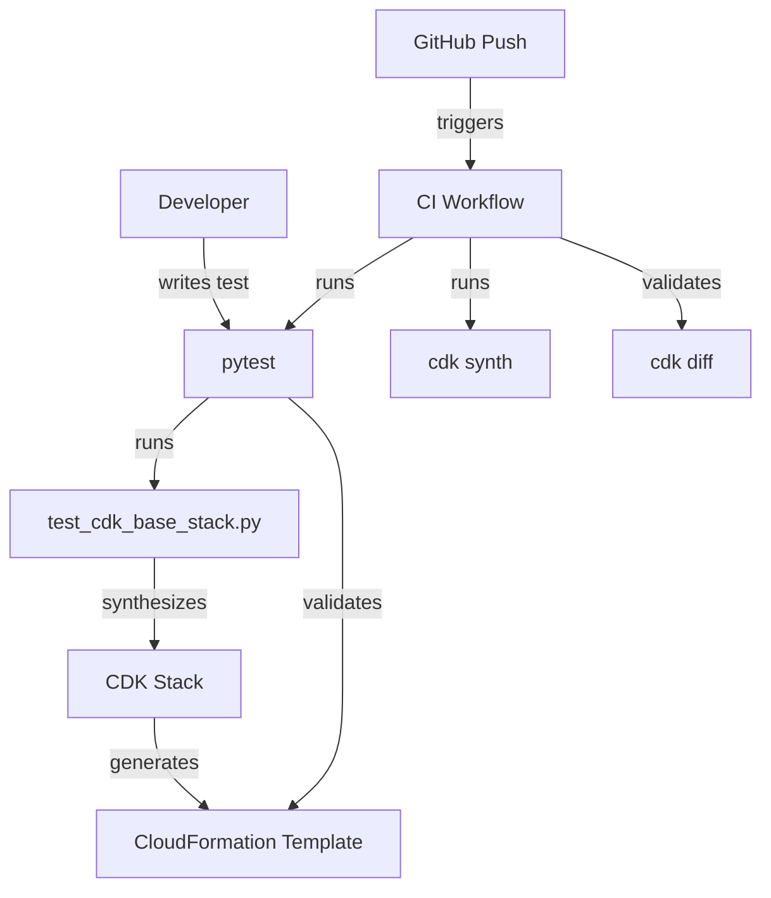
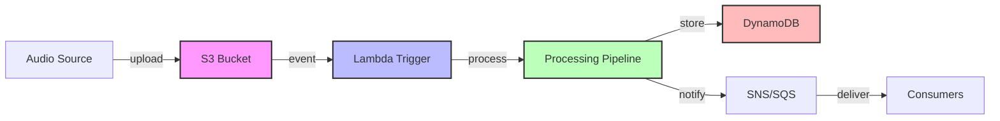

# Architecture Documentation

## Project: cdk-sleep-py-qdev

### Overview
This is a Test-Driven Development (TDD) first AWS CDK project for building an event-driven sleep audio pipeline. The project follows pure issue-driven development practices.

### Development Philosophy

#### TDD-First Approach
1. **Red**: Write a failing test that defines the desired behavior
2. **Green**: Write minimal code to make the test pass
3. **Refactor**: Clean up code while keeping tests green
4. **Sync**: Keep ARCHITECTURE.md and diagrams in perfect sync

#### Issue-Driven Development
- Every feature starts with a GitHub issue
- Issues are broken down into testable units
- Tests are written before implementation
- Architecture documentation is updated with each change

### Project Structure

```
cdk-sleep-py-qdev/
├── .github/
│   └── workflows/
│       └── ci.yml              # CI/CD pipeline
├── cdk_base/
│   ├── __init__.py
│   └── cdk_base_stack.py       # Main CDK stack definition
├── tests/
│   ├── __init__.py
│   └── unit/
│       ├── __init__.py
│       └── test_cdk_base_stack.py  # Stack unit tests
├── app.py                      # CDK app entry point
├── cdk.json                    # CDK configuration
├── requirements.txt            # Production dependencies
├── requirements-dev.txt        # Development dependencies
├── ARCHITECTURE.md             # This file
└── README.md                   # Project documentation
```

### Current Architecture

The project is currently in its initial setup phase with a minimal CDK stack.



### Future Architecture: Event-Driven Sleep Audio Pipeline

The planned architecture will implement an event-driven pipeline for processing sleep audio:



### Stack Components

#### CdkBaseStack
**Status**: Initial/Empty
**Purpose**: Main CDK stack that will contain all infrastructure components
**Location**: `cdk_base/cdk_base_stack.py`

**Current State**:
- Empty stack with no resources
- Ready for TDD-driven resource addition

**Planned Components** (to be added via TDD):
- S3 buckets for audio storage
- Lambda functions for audio processing
- DynamoDB tables for metadata
- SQS queues for event management
- SNS topics for notifications
- IAM roles and policies

### Testing Strategy

1. **Unit Tests**: Test individual CDK constructs using `aws_cdk.assertions`
2. **Template Validation**: Assert expected CloudFormation resources and properties
3. **Fine-Grained Assertions**: Check specific resource properties, counts, and configurations
4. **Continuous Integration**: Automated testing on every push/PR

### Change Log
- **Initial Setup**: Created base TDD infrastructure with CI/CD pipeline
