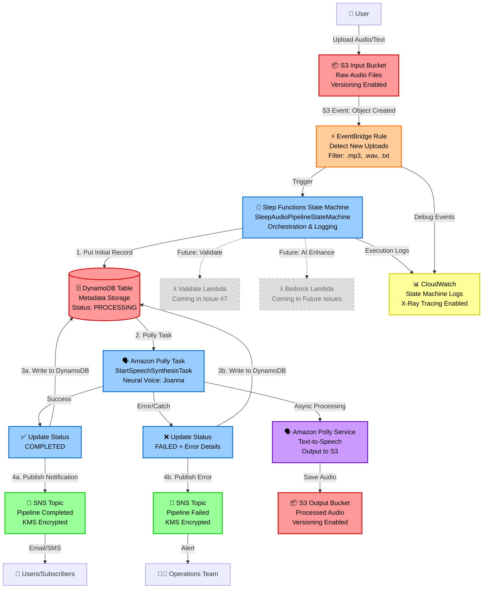

# Architecture Documentation

## Project: cdk-sleep-py-qdev

### Overview
This is a Test-Driven Development (TDD) first AWS CDK project for building an event-driven sleep audio pipeline. The project follows pure issue-driven development practices.

## System Architecture: Event-Driven Sleep Audio Pipeline

### High-Level Overview

The **Event-Driven Sleep Audio Pipeline** is a production-grade, serverless AWS solution designed to process and enhance audio files for sleep and relaxation applications. The system provides:

- **Automated Audio Processing**: Users upload raw audio files (voice recordings, ambient sounds, text files) which are automatically detected and processed through a sophisticated pipeline.
- **AI-Powered Enhancement**: Leverages Amazon Polly for text-to-speech conversion and Amazon Bedrock for AI-generated sleep sounds and audio enhancement.
- **Scalable Event-Driven Architecture**: Uses EventBridge and Step Functions for reliable, scalable orchestration with built-in error handling and retry logic.
- **Comprehensive Metadata Management**: Tracks all audio processing details, user associations, and status information in DynamoDB.
- **Real-Time Notifications**: Provides immediate feedback on processing completion or failures through SNS.
- **Production-Ready Security**: Implements least-privilege IAM, encryption at rest, VPC integration options, and private S3 buckets.
- **Multi-Environment Support**: Fully configurable for dev, stage, and prod environments via CDK context.

### System Architecture Diagram



### Data Flow Explanation

#### 1. Audio Upload (Input)
- **Trigger**: User uploads audio file (`.mp3`, `.wav`, `.flac`) or text file (`.txt`) to the **Input S3 Bucket**
- **Storage**: Files stored with server-side encryption (SSE-KMS) and versioning enabled
- **Naming Convention**: `uploads/{user_id}/{timestamp}-{filename}`
- **Access Control**: Private bucket with pre-signed URL access for authenticated users only

#### 2. Event Detection (EventBridge)
- **Event Source**: S3 bucket configured to send object creation events to EventBridge
- **Event Filtering**: EventBridge rule filters for specific file extensions and path patterns
- **Event Pattern**:
  ```json
  {
    "source": ["aws.s3"],
    "detail-type": ["Object Created"],
    "detail": {
      "bucket": { "name": ["sleep-audio-input-{env}"] },
      "object": { "key": [{ "prefix": "uploads/" }] }
    }
  }
  ```
- **Target**: Step Functions state machine execution with event details as input

#### 3. Orchestration (Step Functions) - **Issue #4 Implementation** ✅
#### 3. Orchestration and Error Handling (Step Functions) - **Issues #4, #5, #6 Implemented** ✅
The **Step Functions State Machine** (`SleepAudioPipelineStateMachine`) has been implemented as the orchestration layer for the audio processing pipeline. This is a **minimal skeleton** implementation as per Issue #4 requirements.
The **Step Functions State Machine** (`SleepAudioPipelineStateMachine`) orchestrates the complete audio processing pipeline with error handling and status tracking.
**Current State Machine Flow (Minimal):**
**Current State Machine Flow (Enhanced with Error Handling):**
Start → Polly Task (StartSpeechSynthesisTask) → End
Start 
  → PutInitialMetadata (status=PROCESSING, Issue #5)
  → PollyTask (StartSpeechSynthesisTask, Issue #4)
    ├─ SUCCESS PATH:
    │   → UpdateStatusCompleted (status=COMPLETED, Issue #6)
    │   → PublishSuccessNotification (SNS, Issue #6)
    │   → End
    └─ ERROR PATH (Catch):
        → UpdateStatusFailed (status=FAILED + error details, Issue #6)
        → PublishErrorNotification (SNS, Issue #6)
        → End

**Polly Task Configuration:**
- **Service**: Amazon Polly
- **Action**: `StartSpeechSynthesisTask` (asynchronous processing)
- **Parameters**:
  - Engine: Neural
  - Output Format: MP3
  - Voice ID: Joanna (soothing female voice)
  - Output S3 Bucket: Configured to write to Output Bucket
  - Text Input: Placeholder (uses S3 object key from event)
- **IAM Permissions**: Least privilege access to Polly actions and S3 read/write
- **Error Handling**: Catch block captures all errors (`States.ALL`) and routes to error handler
- **IAM Permissions**: Least privilege access to Polly actions and S3 read/write

**Error Handling and Status Updates (Issue #6):**
- **Success Path**:
  1. Polly task completes successfully
  2. DynamoDB UpdateItem: Set `status = COMPLETED`, update `updatedAt` timestamp
  3. SNS Publish: Send success notification with audioId, bucket, timestamp
  4. State machine execution completes

- **Error Path**:
  1. Polly task fails (any error type)
  2. Catch block captures error and error details
  3. DynamoDB UpdateItem: Set `status = FAILED`, update `updatedAt` timestamp, store `errorMessage`
  4. SNS Publish: Send error notification with audioId, bucket, timestamp, error details
  5. State machine execution completes (gracefully)

**SNS Topics (Issue #6):**
- **Completed Topic**: `SleepAudioPipelineCompleted`
  - Purpose: Notify users of successful audio processing
  - Encryption: KMS encryption enabled (AWS managed key)
  - Display Name: "Sleep Audio Pipeline Completed"
  - Message Format: JSON with status, audioId, bucket, timestamp, success message

- **Failed Topic**: `SleepAudioPipelineFailed`
  - Purpose: Alert operations team of processing failures
  - Encryption: KMS encryption enabled (AWS managed key)
  - Display Name: "Sleep Audio Pipeline Failed"
  - Message Format: JSON with status, audioId, bucket, timestamp, error details
**Logging and Observability:**
- **CloudWatch Logs**: Dedicated log group at `/aws/stepfunctions/sleep-audio-pipeline`
- **Log Level**: ALL (captures all execution details including input/output data)
- **X-Ray Tracing**: Enabled for distributed tracing
- **Execution Data**: Full execution history captured for debugging

- **Error Tracking**: Failed executions logged with full error context
**Future Enhancements (Upcoming Issues):**
- Issue #5: Add DynamoDB metadata table and input/output handling
- Issue #7: Add validation Lambda function (file format, size checks)
- Future: Add parallel processing branches for different file types

- Future: Add retry logic with exponential backoff
- Future: Add SNS subscriptions (email, SMS) for user notifications
#### 4. Metadata Storage (DynamoDB) - **Coming in Issue #5**
#### 4. Metadata Storage (DynamoDB) - **Issue #5 Implemented** ✅
  ```
  Primary Key: audio_id (String) - UUID v4
  Primary Key: audioId (String) - S3 object key
    - filename (String)
    - status (String) - PROCESSING, COMPLETED, FAILED (Issue #5, #6)
    - inputBucket (String) - Name of input S3 bucket (Issue #5)
    - inputKey (String) - S3 object key (Issue #5)
    - createdAt (String) - ISO timestamp when processing started (Issue #5)
    - updatedAt (String) - ISO timestamp when status last changed (Issue #5, #6)
    - errorMessage (String) - Error details if status=FAILED (Issue #6)
- **Access Patterns**:
  - Query by user_id to list all user audio files
  - Get by audioId for status checks
- **Encryption**: Server-side encryption with KMS customer managed key
- **Encryption**: AWS managed server-side encryption

- **Billing**: Pay-per-request (on-demand)
#### 5. Output Storage (S3 Output Bucket)
- **Storage Structure**: `processed/{user_id}/{audio_id}-{filename}`
- **Versioning**: Enabled for audit trail and rollback capability
- **Lifecycle Policies**:
  - Transition to S3 Intelligent-Tiering after 30 days
  - Transition to Glacier after 90 days
  - Delete after 365 days (configurable)
- **Encryption**: SSE-KMS with customer managed key
- **Access**: Private with pre-signed URLs generated on-demand (15-minute expiration)

#### 6. Notifications (SNS)
#### 6. Notifications (SNS) - **Issue #6 Implemented** ✅
- **Success Topic**: `SleepAudioPipelineCompleted` - Notifies when audio processing completes
  - Future Subscriptions: Email, SMS, SQS (for frontend polling)
- **Error Topic**: `SleepAudioPipelineFailed` - Alerts operations team of failures
  - Future Subscriptions: Email, PagerDuty (optional), CloudWatch Alarms
- **Message Filtering**: Subscribers can filter by error severity or user tier

### AWS Services Rationale

#### Amazon S3 (Simple Storage Service)
**Why**: Durable, scalable object storage for audio files
- **Input Bucket**: Receives raw uploads, integrates natively with EventBridge
- **Output Bucket**: Stores processed audio with lifecycle management
- **Benefits**: 99.999999999% durability, automatic scaling, event notifications, versioning
- **Cost-Effective**: Pay-per-use, lifecycle transitions to cheaper storage classes

#### Amazon EventBridge
**Why**: Decouples event producers from consumers, provides flexible event filtering
- **Alternative Considered**: S3 Lambda triggers - rejected due to tight coupling and limited flexibility
- **Benefits**: 
  - Content-based filtering reduces unnecessary invocations
  - Easy to add additional event consumers (e.g., analytics, auditing)
  - Built-in schema registry and event replay capabilities
  - Supports cross-account and cross-region event routing

#### AWS Step Functions
**Why**: Visual workflow orchestration with built-in error handling and retry logic
- **Alternative Considered**: Lambda-only orchestration - rejected due to complexity of error handling and state management
- **Benefits**:
  - Standard workflow for long-running processes (up to 1 year)
  - Visual workflow editor for easy debugging
  - Automatic state persistence and retry logic
  - Integration with all AWS services without custom code
  - Detailed execution history for troubleshooting
- **Cost**: Pay per state transition (~$25 per million transitions)

#### AWS Lambda
**Why**: Serverless compute for individual processing tasks
- **Functions**:
  1. **Validate Lambda**: Fast file validation (Python 3.12, 256MB RAM, 30s timeout)
  2. **Polly Lambda**: Text-to-speech conversion (Python 3.12, 512MB RAM, 5min timeout)
  3. **Bedrock Lambda**: AI enhancement (Python 3.12, 1024MB RAM, 15min timeout)
- **Benefits**: No server management, automatic scaling, pay-per-invocation
- **Best Practices**: Single responsibility per function, environment variables for configuration

#### Amazon Polly
**Why**: High-quality neural text-to-speech with natural-sounding voices
- **Use Case**: Convert text scripts to soothing audio for sleep stories, meditations
- **Features**: 
  - Neural TTS for realistic voices
  - SSML support for fine-grained control (breathing, whispers)
  - Multiple languages and voices
  - Streaming output for low latency
- **Cost**: $16 per million characters (Neural TTS)

#### Amazon Bedrock
**Why**: Access to foundation models for AI-powered audio enhancement
- **Use Case**: Generate ambient sleep sounds, enhance audio quality, create soundscapes
- **Models**: Support for various foundation models (configurable per environment)
- **Benefits**: 
  - No model training required
  - Managed infrastructure
  - Pay-per-use pricing
- **Note**: Optional component - pipeline works without Bedrock for cost-sensitive deployments

#### Amazon DynamoDB
**Why**: Fast, scalable NoSQL database for audio metadata
- **Access Pattern**: Single-digit millisecond latency, supports high throughput
- **Benefits**:
  - Automatic scaling based on traffic
  - Built-in backup and point-in-time recovery
  - Global tables for multi-region deployments (future)
  - Event streams via DynamoDB Streams (future analytics integration)
- **Capacity**: On-demand pricing mode for unpredictable workloads

#### Amazon SNS (Simple Notification Service)
**Why**: Pub/sub messaging for notifications with multiple delivery protocols
- **Benefits**:
  - Fan-out to multiple subscribers
  - Message filtering at subscription level
  - Dead-letter queues for failed deliveries
  - FIFO topics for ordered notifications (if needed)
- **Cost**: $0.50 per million requests + delivery costs

#### Amazon CloudWatch
**Why**: Centralized logging, monitoring, and alarming
- **Components**:
  - **Logs**: Aggregated logs from Lambda, Step Functions, EventBridge
  - **Metrics**: Custom metrics for processing time, error rates, file sizes
  - **Alarms**: Automated alerts for failures, high latency, cost overruns
  - **X-Ray**: Distributed tracing for end-to-end request tracking (optional)
- **Log Retention**: 7 days (dev), 30 days (stage), 90 days (prod)

### Security Considerations

#### 1. Identity and Access Management (IAM)
- **Least Privilege Principle**: Each Lambda function has minimal required permissions
  - Validate Lambda: `s3:GetObject` (input bucket), `dynamodb:PutItem`
  - Polly Lambda: `s3:GetObject` (input), `s3:PutObject` (output), `polly:SynthesizeSpeech`, `dynamodb:UpdateItem`
  - Bedrock Lambda: `s3:GetObject`, `s3:PutObject`, `bedrock:InvokeModel`, `dynamodb:UpdateItem`
- **Service Roles**: Step Functions uses dedicated execution role with `lambda:InvokeFunction`, `sns:Publish`
- **Cross-Service Policies**: S3 to EventBridge, EventBridge to Step Functions
- **No Hardcoded Credentials**: All access via IAM roles and temporary credentials
- **Condition Keys**: Restrict access by source IP, MFA, time of day (optional)

#### 2. Encryption
- **At Rest**:
  - S3: SSE-KMS with customer managed key, bucket key enabled for cost optimization
  - DynamoDB: KMS encryption for table data
  - SNS: KMS encryption for messages
  - Lambda: Encrypted environment variables with KMS
- **In Transit**:
  - All AWS service communication over TLS 1.2+
  - Pre-signed URLs enforce HTTPS only
- **Key Management**:
  - Customer managed KMS keys per environment
  - Automatic key rotation enabled (yearly)
  - CloudTrail logging of all key usage

#### 3. Network Security
- **S3 Buckets**:
  - Block public access enabled
  - Bucket policies enforce encryption in transit (`aws:SecureTransport`)
  - VPC endpoints for private access from Lambda (optional)
- **Lambda Functions**:
  - VPC integration optional (for databases, private endpoints)
  - Security groups and NACLs for VPC-enabled functions
- **DynamoDB**:
  - VPC endpoints for private access (no internet gateway required)

#### 4. Input Validation and Sanitization
- **File Validation**:
  - Whitelist file extensions (`.mp3`, `.wav`, `.flac`, `.txt`)
  - Max file size limits (100MB default, configurable)
  - Content-type verification (prevent file upload attacks)
  - Virus scanning integration (ClamAV Lambda layer or third-party)
- **Text Content**:
  - Sanitize text input for Polly (prevent SSML injection attacks)
  - Character limit enforcement (5000 characters default)

#### 5. Compliance and Auditing
- **CloudTrail**: All API calls logged for audit trail
- **S3 Access Logs**: Track all object access for security analysis
- **VPC Flow Logs**: Network traffic monitoring (if VPC-enabled)
- **Config Rules**: Automated compliance checks (encryption enabled, public access blocked)

### Development Philosophy

#### TDD-First Approach
1. **Red**: Write a failing test that defines the desired behavior
2. **Green**: Write minimal code to make the test pass
3. **Refactor**: Clean up code while keeping tests green
4. **Sync**: Keep ARCHITECTURE.md and diagrams in perfect sync

#### Issue-Driven Development
- Every feature starts with a GitHub issue
- Issues are broken down into testable units
- Tests are written before implementation
- Architecture documentation is updated with each change

### Observability Strategy

#### 1. CloudWatch Logs
- **Log Groups**: Separate log group per Lambda function and Step Functions state machine
- **Structured Logging**: JSON format with correlation IDs for request tracing
- **Log Levels**: DEBUG (dev), INFO (stage), WARN/ERROR (prod)
- **Searchable Fields**: audio_id, user_id, status, error_type, processing_time

#### 2. CloudWatch Metrics
- **Standard Metrics**: Lambda duration, invocations, errors, concurrent executions
- **Custom Metrics**:
  - `AudioProcessingTime`: Time from upload to completion
  - `FileSize`: Distribution of uploaded file sizes
  - `ErrorRate`: Percentage of failed processing attempts
  - `PollyCharacters`: Total characters processed by Polly (cost tracking)
  - `BedrockInvocations`: Bedrock API call count (cost tracking)

#### 3. CloudWatch Alarms
- **Error Rate Alarm**: Trigger if error rate > 5% over 5 minutes
- **Lambda Throttling**: Alert if concurrent execution limit reached
- **Step Functions Failed Executions**: Immediate alert on any execution failure
- **DynamoDB Capacity**: Alert on throttled requests (if provisioned capacity)
- **Cost Anomaly**: Alert on unexpected spend increase (> 20% week-over-week)

#### 4. AWS X-Ray (Optional)
- **Distributed Tracing**: End-to-end request flow visualization
- **Service Map**: Visual representation of service dependencies
- **Performance Analysis**: Identify bottlenecks in processing pipeline

#### 5. Dashboards
- **Operational Dashboard**: Real-time metrics for processing pipeline health
- **Business Dashboard**: Usage statistics, user engagement, file type distribution
- **Cost Dashboard**: Daily spend breakdown by service

### Cost Considerations

#### Estimated Monthly Costs (Assumptions: 10,000 audio files/month, avg 5MB each)

| Service | Usage | Cost Estimate |
|---------|-------|---------------|
| **S3 Storage** | 50GB stored, 10K PUT, 20K GET | $1.15 + $0.05 + $0.01 = **$1.21** |
| **EventBridge** | 10K events | $0.01 (free tier) = **$0.00** |
| **Step Functions** | 10K executions, 5 states avg | 50K transitions = **$1.25** |
| **Lambda** | 10K invocations, 30K GB-sec | $0.60 = **$0.60** |
| **Polly** | 1M characters (100 files) | $16.00 = **$16.00** |
| **Bedrock** | Variable by model | $10-50 = **$30.00** (avg) |
| **DynamoDB** | On-demand, 30K writes, 100K reads | $3.00 = **$3.00** |
| **SNS** | 10K notifications | $0.50 = **$0.50** |
| **CloudWatch** | 5GB logs, 10 custom metrics | $2.50 + $3.00 = **$5.50** |
| **KMS** | 1 key, 50K requests | $1.00 + $0.15 = **$1.15** |
| **TOTAL** | | **~$59.21/month** |

#### Cost Optimization Strategies
1. **S3 Lifecycle Policies**: Move to cheaper storage tiers after 30/90 days
2. **Lambda Provisioned Concurrency**: Only for prod, not dev/stage
3. **DynamoDB On-Demand**: Switch to provisioned if traffic is predictable
4. **CloudWatch Logs Retention**: 7 days dev, 30 days stage, 90 days prod
5. **EventBridge vs Direct Lambda**: EventBridge adds minimal cost but provides flexibility
6. **Bedrock Optional**: Make AI enhancement opt-in for cost-sensitive users
7. **Reserved Capacity**: Consider Savings Plans for predictable baseline traffic

### Multi-Environment Support

The architecture supports three environments via CDK context:

#### Development (dev)
- **Purpose**: Local development and experimentation
- **Configuration**:
  - Single-AZ resources where applicable
  - Minimal log retention (7 days)
  - Smaller Lambda memory allocations
  - No Bedrock integration (cost savings)
  - DynamoDB on-demand mode
- **Naming**: `{resource-name}-dev`
- **Deployment**: Automated on push to `develop` branch

#### Staging (stage)
- **Purpose**: Pre-production testing with prod-like configuration
- **Configuration**:
  - Multi-AZ resources
  - Moderate log retention (30 days)
  - Production Lambda memory allocations
  - Bedrock enabled with test models
  - DynamoDB on-demand mode
- **Naming**: `{resource-name}-stage`
- **Deployment**: Manual approval required

#### Production (prod)
- **Purpose**: Live customer-facing environment
- **Configuration**:
  - Multi-AZ resources with high availability
  - Extended log retention (90 days)
  - Optimized Lambda configurations
  - Full Bedrock integration
  - DynamoDB provisioned capacity with auto-scaling
  - Enhanced monitoring and alarms
  - Multi-region (future consideration)
- **Naming**: `{resource-name}-prod`
- **Deployment**: Manual approval + automated testing required

#### CDK Context Configuration
```json
{
  "environments": {
    "dev": {
      "account": "123456789012",
      "region": "us-east-1",
      "log_retention_days": 7,
      "enable_bedrock": false,
      "dynamodb_billing": "PAY_PER_REQUEST"
    },
    "stage": {
      "account": "123456789012",
      "region": "us-east-1",
      "log_retention_days": 30,
      "enable_bedrock": true,
      "dynamodb_billing": "PAY_PER_REQUEST"
    },
    "prod": {
      "account": "987654321098",
      "region": "us-east-1",
      "log_retention_days": 90,
      "enable_bedrock": true,
      "dynamodb_billing": "PROVISIONED"
    }
  }
}
```

### Future Extensibility

The architecture is designed for future enhancements:

#### Near-Term Extensions (Next 6 Months)
1. **User Authentication**: Integrate Amazon Cognito for user management
2. **API Gateway**: Add REST/GraphQL API for programmatic access
3. **Real-Time Progress**: WebSocket API for live processing status updates
4. **Batch Processing**: SQS queue for bulk audio file processing
5. **Advanced Audio Mixing**: Mix multiple audio tracks (voice + background + binaural)
6. **Scheduled Processing**: EventBridge scheduled rules for timed releases

#### Medium-Term Extensions (6-12 Months)
7. **Multi-Region Deployment**: Active-active setup for global low latency
8. **Content Delivery**: CloudFront CDN for fast audio streaming
9. **Analytics Pipeline**: DynamoDB Streams → Lambda → Amazon Athena for usage analytics
10. **Machine Learning**: SageMaker integration for custom audio ML models
11. **Audio Transcription**: Amazon Transcribe for reverse text extraction
12. **Quality Ratings**: User feedback loop for audio quality improvement

#### Long-Term Extensions (12+ Months)
13. **Microservices Architecture**: Break processing into specialized services
14. **Event Sourcing**: Complete audit trail with event replay capability
15. **CQRS Pattern**: Separate read/write models for scalability
16. **GraphQL Subscriptions**: Real-time notifications via AppSync
17. **Mobile SDK**: Native iOS/Android libraries for direct integration
18. **Partner Integrations**: Webhooks for third-party audio platforms

#### Scalability Considerations
- **Current Design**: Handles up to 100K files/month with current architecture
- **Scale to 1M+**: Requires:
  - DynamoDB Global Secondary Indexes for additional access patterns
  - S3 request rate optimization (prefix distribution)
  - Lambda reserved concurrency to prevent throttling
  - Step Functions Express Workflows for high-volume, short-duration processing
  - ElastiCache for metadata caching

### Project Structure

```
cdk-sleep-py-qdev/
├── .github/
│   └── workflows/
│       └── ci.yml              # CI/CD pipeline
├── cdk_base/
│   ├── __init__.py
│   └── cdk_base_stack.py       # Main CDK stack definition
├── tests/
│   ├── __init__.py
│   └── unit/
│       ├── __init__.py
│       └── test_cdk_base_stack.py  # Stack unit tests
├── app.py                      # CDK app entry point
├── cdk.json                    # CDK configuration
├── requirements.txt            # Production dependencies
├── requirements-dev.txt        # Development dependencies
├── ARCHITECTURE.md             # This file
└── README.md                   # Project documentation
```

### Stack Components

#### CdkBaseStack
**Status**: Foundational Infrastructure Implemented (Issue #3)
**Purpose**: Main CDK stack that will contain all infrastructure components
**Location**: `cdk_base/cdk_base_stack.py`

**Implemented Components** (via TDD - Issue #3):

1. **Input S3 Bucket** (`SleepAudioInputBucket`) ✅
   - **Status**: Implemented
   - **Purpose**: Receives raw audio files (`.mp3`, `.wav`, `.flac`) and text files (`.txt`) from users
   - **Configuration**:
     - Encryption: S3-managed (AES256)
     - Versioning: Enabled
     - Public Access: Blocked (all public access blocked)
     - EventBridge Integration: Enabled (sends Object Created events)
     - SSL/TLS: Enforced via bucket policies
     - Removal Policy: RETAIN (protects production data from accidental deletion)
   - **Event Flow**: File uploads automatically trigger EventBridge notifications

2. **Output S3 Bucket** (`SleepAudioOutputBucket`) ✅
   - **Status**: Implemented
   - **Purpose**: Stores processed and enhanced audio files
   - **Configuration**:
     - Encryption: S3-managed (AES256)
     - Versioning: Enabled
     - Public Access: Blocked (all public access blocked)
     - SSL/TLS: Enforced via bucket policies
     - Removal Policy: RETAIN (protects production data from accidental deletion)
   - **Access Pattern**: Pre-signed URLs will be generated for secure downloads (future enhancement)

3. **EventBridge Rule** (`SleepAudioInputRule`) ✅
   - **Status**: Implemented
   - **Purpose**: Detects new file uploads to Input Bucket and triggers processing workflow
   - **Configuration**:
     - Event Source: `aws.s3`
     - Event Type: `Object Created`
     - Filter: Only events from the Input Bucket (by bucket name)
     - State: Enabled
   - **Current Target**: CloudWatch Logs (placeholder for testing)
   - **Future Target**: Step Functions state machine (Issue #4)
   - **Event Pattern**:
     ```json
     {
       "source": ["aws.s3"],
       "detail-type": ["Object Created"],
       "detail": {
         "bucket": {
           "name": ["<input-bucket-name>"]
         }
       }
     }
     ```

5. **Step Functions State Machine** (`SleepAudioPipelineStateMachine`) ✅
   - **Status**: Implemented (Issue #4)
   - **Purpose**: Orchestrates the audio processing workflow
   - **Configuration**:
     - State Machine Type: Standard (for long-running workflows)
     - Logging: CloudWatch Logs with ALL level logging
     - Log Group: `/aws/stepfunctions/sleep-audio-pipeline`
     - X-Ray Tracing: Enabled
     - Execution Role: Dedicated IAM role with least-privilege permissions
   - **Current States**:
     - **Polly Task**: Calls Amazon Polly `StartSpeechSynthesisTask` API
       - Engine: Neural
       - Voice: Joanna
       - Output Format: MP3
       - Output Destination: Output S3 Bucket
   - **IAM Permissions**:
     - `polly:StartSpeechSynthesisTask`, `polly:GetSpeechSynthesisTask`, `polly:ListSpeechSynthesisTasks`
     - `s3:GetObject` on Input Bucket
     - `s3:PutObject` on Output Bucket
     ```

4. **CloudWatch Log Group** (`SleepAudioEventLogGroup`) ✅
   - **Status**: Implemented (placeholder)
   - **Purpose**: Temporary target for EventBridge rule to validate event flow
   - **Location**: `/aws/events/sleep-audio-pipeline`
   - **Note**: Now serves as secondary target (Issue #4) - primary target is Step Functions

6. **CloudWatch Log Group for State Machine** (`SleepAudioStateMachineLogGroup`) ✅
   - **Status**: Implemented (Issue #4)
   - **Purpose**: Captures Step Functions execution logs for observability
   - **Location**: `/aws/stepfunctions/sleep-audio-pipeline`
   - **Removal Policy**: DESTROY (safe to delete logs in dev/test)

**Pending Components** (to be added in future issues):
7. **DynamoDB Table for Metadata** (`SleepAudioMetadataTable`) ✅
   - **Status**: Implemented (Issue #5)
   - **Purpose**: Stores metadata for all audio files processed through the pipeline
   - **Configuration**:
     - **Partition Key**: `audioId` (String) - Uses S3 object key as unique identifier
     - **Billing Mode**: PAY_PER_REQUEST (on-demand)
     - **Encryption**: AWS-managed server-side encryption enabled
     - **Point-in-Time Recovery**: Enabled for data protection
     - **Removal Policy**: DESTROY (safe for dev/test environments)
   - **Initial Attributes Tracked**:
     - `audioId`: Primary key, S3 object key
     - `status`: Processing status (PROCESSING, COMPLETED, FAILED)
     - `inputBucket`: Name of S3 bucket containing input file
     - `inputKey`: S3 object key of input file
     - `createdAt`: Timestamp when record was created (from state machine execution time)
     - `updatedAt`: Timestamp when record was last updated
   - **State Machine Integration**:
     - DynamoDB PutItem task writes initial record at start of workflow
     - Captures S3 event data (bucket, object key) from EventBridge
     - Sets initial status to "PROCESSING"
     - Uses Step Functions JsonPath to extract data from S3 event
     - Records state machine execution start time
   - **IAM Permissions**:
  - **Issue #6 Enhancements**:
    - ✅ UpdateItem tasks for COMPLETED/FAILED status
    - ✅ Error message attribute capture
    - Future: Add more attributes (file size, duration, Polly voice)
8. **SNS Topics for Notifications** - **Issue #6 Implemented** ✅
   - **Status**: Implemented
   - **Purpose**: Provide real-time notifications for pipeline completion and failures
   - **Topics**:
     - **SleepAudioPipelineCompleted**: Success notifications
       - Encryption: KMS encryption enabled (AWS managed key)
       - Display Name: "Sleep Audio Pipeline Completed"
       - Message includes: status, audioId, bucket, timestamp, success message
     - **SleepAudioPipelineFailed**: Error notifications
       - Encryption: KMS encryption enabled (AWS managed key)
       - Display Name: "Sleep Audio Pipeline Failed"
       - Message includes: status, audioId, bucket, timestamp, error details
   - **State Machine Integration**:
     - SNS Publish task on success path (after UpdateStatusCompleted)
     - SNS Publish task on error path (after UpdateStatusFailed)
     - Uses `SnsPublish` L2 construct with proper message formatting
   - **IAM Permissions**:
     - State machine role has `sns:Publish` permission for both topics
     - Granted via `grant_publish()` for least-privilege access
   - **Future Enhancements**:
     - Add email/SMS subscriptions for user notifications
     - Add SQS subscription for frontend status polling
     - Add PagerDuty integration for operations alerts
     - Add message filtering for severity levels

9. **Error Handling in State Machine** - **Issue #6 Implemented** ✅
   - **Status**: Implemented
   - **Purpose**: Gracefully handle failures and provide visibility into errors
   - **Implementation**:
     - Catch block on Polly task captures all errors (`States.ALL`)
     - Error path updates DynamoDB status to FAILED with error details
     - Error path publishes notification to failed SNS topic
     - Both success and error paths complete gracefully (no unhandled failures)
   - **Error Information Captured**:
     - Error type/code from Step Functions
     - Error message with context
     - Timestamp of failure
     - audioId and bucket for troubleshooting

**Pending Components** (to be added in future issues):
- Lambda functions for audio processing (validate, bedrock) - **Issue #7+**
- Bedrock integration for AI enhancement - **Future**
- Retry logic with exponential backoff - **Future**

- Error handling and retry logic in state machine - **Issue #6**
- Error handling and retry logic in state machine
- Bedrock integration for AI enhancement

- Status update tasks in state machine (COMPLETED/FAILED)
### Testing Strategy

1. **Unit Tests**: Test individual CDK constructs using `aws_cdk.assertions`
2. **Template Validation**: Assert expected CloudFormation resources and properties
3. **Fine-Grained Assertions**: Check specific resource properties, counts, and configurations
4. **Continuous Integration**: Automated testing on every push/PR
5. **Integration Tests**: End-to-end testing of the complete pipeline (future)
6. **Security Tests**: IAM policy validation, encryption verification

### Change Log

#### Issue #1: Initial Setup
- Created base TDD infrastructure with CI/CD pipeline
- Set up pytest testing framework with aws-cdk assertions
- Configured GitHub Actions workflow for automated testing
- Established project structure following Python CDK best practices

#### Issue #2: Architecture Documentation
- **Issue #2**: Comprehensive architecture documentation and Mermaid diagram for Event-Driven Sleep Audio Pipeline
- Created detailed Mermaid diagram showing complete system architecture
- Documented all AWS services and their rationale
- Defined security considerations and best practices
- Established multi-environment support strategy
- Outlined future extensibility and scalability considerations

#### Issue #3: Foundational Infrastructure (TDD Implementation) ✅
**Date**: Current Release
**Approach**: Strict Test-Driven Development (Red-Green-Refactor)

**Changes Made**:
1. **Test Phase (Red)**:
   - Added comprehensive CDK assertion tests for S3 buckets (input/output)
   - Added tests for EventBridge rule configuration and event patterns
   - Tests verify encryption, versioning, public access blocking, and event notifications
   - All tests initially failed (as expected in TDD)

2. **Implementation Phase (Green)**:
   - Implemented `SleepAudioInputBucket` with S3-managed encryption, versioning, and EventBridge integration
   - Implemented `SleepAudioOutputBucket` with matching security configuration
   - Implemented `SleepAudioInputRule` (EventBridge) to detect Object Created events
   - Added CloudWatch Log Group as placeholder target for event rule
   - All tests now pass

3. **Documentation Update**:
   - Updated ARCHITECTURE.md to reflect implemented components
#### Issue #4: Step Functions State Machine with Polly Integration (TDD Implementation) ✅
**Date**: Current Release
**Approach**: Strict Test-Driven Development (Red-Green-Refactor)

**Changes Made**:
1. **Test Phase (Red)**:
   - Added 6 comprehensive TDD tests for Step Functions state machine
   - Tests verify: state machine existence, CloudWatch logging, IAM roles, Polly task, EventBridge targeting, and Polly permissions
   - All tests initially failed (as expected in TDD)

2. **Implementation Phase (Green)**:
   - Implemented `SleepAudioPipelineStateMachine` with minimal Polly task skeleton
   - Used `CallAwsService` task to invoke Polly `StartSpeechSynthesisTask` API
   - Configured CloudWatch Logs (ALL level) and X-Ray tracing for observability
   - Updated EventBridge rule to target state machine (primary) and CloudWatch Logs (secondary)
   - Granted least-privilege IAM permissions: S3 read/write, Polly synthesis tasks
   - All tests now pass ✅

3. **Documentation Update**:
   - Updated ARCHITECTURE.md with simplified Mermaid diagram showing current implementation
   - Marked Step Functions state machine as implemented (✅)
   - Added detailed section on orchestration layer with Polly integration
   - Documented future enhancements for upcoming issues
#### Issue #5: DynamoDB Metadata Table + Step Functions I/O Handling (TDD Implementation) ✅
**Date**: Previous Release
**Approach**: Strict Test-Driven Development (Red-Green-Refactor)

**Changes Made**:
1. **Test Phase (Red)**:
   - Added 6 comprehensive TDD tests for DynamoDB table and state machine integration
   - Tests verify: table existence, key schema, encryption, billing mode, point-in-time recovery, IAM permissions
   - All tests initially failed (as expected in TDD)

2. **Implementation Phase (Green)**:
   - Implemented `SleepAudioMetadataTable` with audioId as partition key
   - Added DynamoDB PutItem task at start of state machine workflow
   - Configured AWS-managed encryption and point-in-time recovery
   - Granted DynamoDB write permissions to state machine role
   - All tests now pass ✅

3. **Documentation Update**:
   - Updated ARCHITECTURE.md with DynamoDB table details
   - Documented table schema and state machine integration

#### Issue #6: SNS Notifications and Error Handling (TDD Implementation) ✅
**Date**: Current Release
**Approach**: Strict Test-Driven Development (Red-Green-Refactor)

**Changes Made**:
1. **Test Phase (Red)**:
   - Added 12 comprehensive TDD tests for SNS topics and error handling
   - Tests verify: SNS topics (2), encryption, display names, state machine error handling (Catch blocks), SNS publish tasks, DynamoDB status updates (COMPLETED/FAILED), IAM permissions (SNS publish, DynamoDB update)
   - All tests initially failed (as expected in TDD)

2. **Implementation Phase (Green)**:
   - Implemented 2 SNS topics: `SleepAudioPipelineCompleted` and `SleepAudioPipelineFailed`
   - Both topics encrypted with AWS managed KMS keys
   - Added Catch block to Polly task to handle all errors
   - Created error handler chain: UpdateStatusFailed → PublishErrorNotification
   - Created success chain: PollyTask → UpdateStatusCompleted → PublishSuccessNotification
   - Added DynamoDB UpdateItem tasks for COMPLETED and FAILED status updates
   - Added SNS Publish tasks for success and error notifications
   - Granted SNS publish permissions to state machine role
   - All tests now pass ✅

3. **Documentation Update**:
   - Updated ARCHITECTURE.md with enhanced Mermaid diagram showing error paths
   - Added SNS topics documentation with encryption details
   - Documented complete state machine flow with success and error paths
   - Updated Stack Components section with SNS and error handling details
   - Added Issue #6 to Change Log
   - Marked Input/Output buckets and EventBridge rule as implemented (✅)

#### Issue #7: Lambda Function Integration (TDD Implementation) ✅
**Date**: Current Release
**Approach**: Strict Test-Driven Development (Red-Green-Refactor)

**Changes Made**:
1. **Test Phase (Red)**:
   - Added 8 comprehensive TDD tests for Lambda function integration
   - Tests verify: Lambda function existence, Python runtime, handler configuration, environment variables, execution role, state machine Lambda invocation, IAM permissions, snapshot test
   - All tests initially failed (as expected in TDD)

2. **Implementation Phase (Green)**:
   - Created `SleepAudioProcessor` Lambda function with Python 3.12 runtime
   - Implemented minimal handler in `lambda/audio_processor/handler.py`
   - Handler logs S3 event details and returns success response
   - Added Lambda invocation task in state machine (between PutInitialMetadata and Polly)
   - Granted DynamoDB read permissions to Lambda (for future enhancements)
   - Granted Lambda invoke permissions to state machine role
   - All tests now pass ✅

3. **Documentation Update**:
   - Updated ARCHITECTURE.md Mermaid diagram to show Lambda function in workflow
   - Added Lambda function section describing current role and future purpose
   - Updated state machine flow description to include Lambda invocation
   - Added Lambda to AWS Services Rationale section
   - Updated project structure to show lambda/ directory
   - Added Issue #7 to Change Log

#### Issue #8: Complete Pipeline Wiring with Input Validation (TDD Implementation) ✅
**Date**: Current Release
**Approach**: Strict Test-Driven Development (Red-Green-Refactor)

**Milestone**: This issue represents a major milestone - the **complete basic pipeline** is now functionally connected and operational.

**Changes Made**:

1. **Test Phase (Red)** - 8 New TDD Tests:
   - Added comprehensive tests for complete pipeline integration
   - Tests verify: EventBridge→Step Functions wiring, all orchestration steps, Lambda error handling, validation error paths, DynamoDB/SNS updates on errors, IAM permissions, complete stack snapshot
   - All tests initially failed (as expected in TDD) ✅

2. **Implementation Phase (Green)** - Input Validation & Error Handling:
   
   **Lambda Handler Enhancement** (`lambda/audio_processor/handler.py`):
   - Added `validate_s3_event()` function to validate event structure and required fields (bucket, key)
   - Added `validate_file_extension()` function with supported formats: `.mp3`, `.wav`, `.flac`, `.txt`, `.m4a`, `.ogg`
   - Added custom `ValidationError` exception class for structured error handling
   - Enhanced `lambda_handler()` to call validation functions before processing
   - Validation errors are re-raised so Step Functions can catch and handle them
   - Comprehensive error logging for troubleshooting
   
   **State Machine Enhancement** (`cdk_base/cdk_base_stack.py`):
   - Added Catch block to Lambda invocation task to handle validation and runtime errors
   - Routes Lambda errors to error handler chain: UpdateStatusFailed → PublishErrorNotification
   - Created separate error handler chains for Lambda and Polly errors with contextual messages
   - Both error paths update DynamoDB status to FAILED and publish to failure SNS topic
   - All error paths complete gracefully (no unhandled failures)
   
   - All tests now pass ✅

3. **Documentation Update**:
   - Updated ARCHITECTURE.md with complete pipeline documentation
   - Documented input validation features and error handling
   - Added end-to-end flow summary for success and error paths
   - Documented security and IAM permissions across all components
   - Added Issue #8 to Change Log

**End-to-End Flow Summary (Complete Pipeline)**:

**Success Path**:
1. User uploads file to S3 Input Bucket
2. S3 sends "Object Created" event to EventBridge
3. EventBridge rule triggers Step Functions state machine
4. State machine creates DynamoDB record (status=PROCESSING)
5. State machine invokes Lambda for validation
6. Lambda validates S3 event structure and file extension
7. Lambda returns success response
8. State machine invokes Polly for text-to-speech synthesis
9. Polly completes successfully
10. State machine updates DynamoDB (status=COMPLETED)
11. State machine publishes success notification to SNS
12. Pipeline execution completes ✅

**Error Path (Validation Failure)**:
1-5. Same as success path
6. Lambda validation fails (invalid extension or missing fields)
7. Lambda raises ValidationError
8. Step Functions Catch block intercepts error
9. State machine updates DynamoDB (status=FAILED, errorMessage=validation error)
10. State machine publishes error notification to SNS
11. Pipeline execution completes gracefully ❌

**Error Path (Polly Failure)**:
1-7. Same as success path
8. Polly task fails (service error, invalid parameters, etc.)
9. Step Functions Catch block intercepts error
10. State machine updates DynamoDB (status=FAILED, errorMessage=Polly error)
11. State machine publishes error notification to SNS
12. Pipeline execution completes gracefully ❌

**Security & IAM**:
- Lambda has DynamoDB read permissions (for future enhancements)
- State machine has Lambda invoke permissions (least privilege)
- State machine has DynamoDB read/write permissions
- State machine has S3 read (input) and write (output) permissions
- State machine has Polly synthesis permissions
- State machine has SNS publish permissions (both topics)
- All permissions follow least-privilege principle

**Next Steps** (Issue #9):
- Pipeline testing and refinement
- Deployment preparation and documentation
