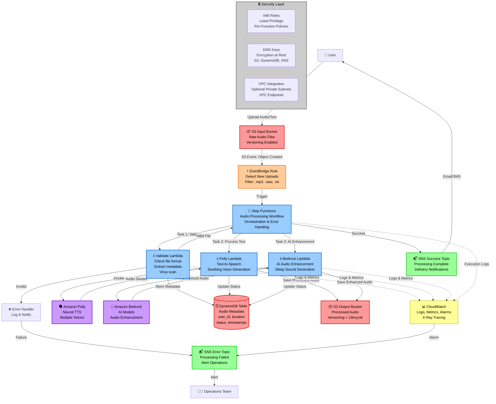

# Architecture Documentation

## Project: cdk-sleep-py-qdev

### Overview
This is a Test-Driven Development (TDD) first AWS CDK project for building an event-driven sleep audio pipeline. The project follows pure issue-driven development practices.

## System Architecture: Event-Driven Sleep Audio Pipeline

### High-Level Overview

The **Event-Driven Sleep Audio Pipeline** is a production-grade, serverless AWS solution designed to process and enhance audio files for sleep and relaxation applications. The system provides:

- **Automated Audio Processing**: Users upload raw audio files (voice recordings, ambient sounds, text files) which are automatically detected and processed through a sophisticated pipeline.
- **AI-Powered Enhancement**: Leverages Amazon Polly for text-to-speech conversion and Amazon Bedrock for AI-generated sleep sounds and audio enhancement.
- **Scalable Event-Driven Architecture**: Uses EventBridge and Step Functions for reliable, scalable orchestration with built-in error handling and retry logic.
- **Comprehensive Metadata Management**: Tracks all audio processing details, user associations, and status information in DynamoDB.
- **Real-Time Notifications**: Provides immediate feedback on processing completion or failures through SNS.
- **Production-Ready Security**: Implements least-privilege IAM, encryption at rest, VPC integration options, and private S3 buckets.
- **Multi-Environment Support**: Fully configurable for dev, stage, and prod environments via CDK context.

### System Architecture Diagram



### Data Flow Explanation

#### 1. Audio Upload (Input)
- **Trigger**: User uploads audio file (`.mp3`, `.wav`, `.flac`) or text file (`.txt`) to the **Input S3 Bucket**
- **Storage**: Files stored with server-side encryption (SSE-KMS) and versioning enabled
- **Naming Convention**: `uploads/{user_id}/{timestamp}-{filename}`
- **Access Control**: Private bucket with pre-signed URL access for authenticated users only

#### 2. Event Detection (EventBridge)
- **Event Source**: S3 bucket configured to send object creation events to EventBridge
- **Event Filtering**: EventBridge rule filters for specific file extensions and path patterns
- **Event Pattern**:
  ```json
  {
    "source": ["aws.s3"],
    "detail-type": ["Object Created"],
    "detail": {
      "bucket": { "name": ["sleep-audio-input-{env}"] },
      "object": { "key": [{ "prefix": "uploads/" }] }
    }
  }
  ```
- **Target**: Step Functions state machine execution with event details as input

#### 3. Orchestration (Step Functions)
The Step Functions state machine orchestrates the entire processing workflow with the following states:

- **State 1: Validation**
  - Invoke Validate Lambda to check file format, size, and content
  - Perform virus/malware scanning (optional integration with third-party tools)
  - Extract initial metadata (filename, size, content-type, upload timestamp)
  - Write initial record to DynamoDB with status `VALIDATING`
  - On failure: transition to error handler

- **State 2: Parallel Processing (Choice)**
  - Based on file type, choose processing path:
    - **Text files (`.txt`)**: Route to Polly Lambda for TTS conversion
    - **Audio files (`.mp3`, `.wav`)**: Route to Bedrock Lambda for enhancement
    - **Both**: Execute parallel branches for multi-stage processing

- **State 3: Text-to-Speech (Polly Lambda)**
  - Read text content from S3
  - Call Amazon Polly API with:
    - Voice ID: Neural voices (e.g., Joanna, Matthew, Amy)
    - Output format: MP3, PCM
    - Speech rate: Optimized for relaxation (80-90% speed)
    - SSML support for advanced control (pauses, emphasis, prosody)
  - Stream audio output to temporary buffer
  - Upload generated audio to Output S3 Bucket
  - Update DynamoDB: status `POLLY_COMPLETE`, audio duration, output S3 key

- **State 4: AI Enhancement (Bedrock Lambda)**
  - Download audio file from Input S3 or Polly output
  - Invoke Bedrock foundation model for:
    - Background ambient sound generation (rain, ocean, white noise)
    - Audio quality enhancement (noise reduction, normalization)
    - Mixing with binaural beats or ASMR elements
  - Upload enhanced audio to Output S3 Bucket
  - Update DynamoDB: status `ENHANCED`, processing details

- **State 5: Completion**
  - Update DynamoDB: final status `COMPLETED`
  - Publish success message to SNS Success Topic
  - Include download URL (pre-signed) and metadata summary

- **Error Handling (Catch States)**
  - Any task failure caught by error handler
  - Update DynamoDB: status `FAILED`, error details
  - Publish failure message to SNS Error Topic
  - Log detailed error information to CloudWatch
  - Implement exponential backoff retry logic (3 retries max)

#### 4. Metadata Storage (DynamoDB)
- **Table Structure**:
  ```
  Primary Key: audio_id (String) - UUID v4
  Sort Key: user_id (String)
  Attributes:
    - filename (String)
    - upload_timestamp (Number - Unix timestamp)
    - file_size (Number - bytes)
    - file_type (String - MIME type)
    - status (String - VALIDATING, PROCESSING, COMPLETED, FAILED)
    - input_s3_key (String)
    - output_s3_key (String)
    - duration_seconds (Number)
    - polly_voice_id (String - optional)
    - bedrock_model_id (String - optional)
    - processing_time_ms (Number)
    - error_message (String - optional)
    - completed_timestamp (Number - Unix timestamp)
  ```
- **Access Patterns**:
  - Query by user_id to list all user audio files
  - Get specific audio_id for status checks
  - GSI on status for operational queries (find all FAILED items)
- **Encryption**: Server-side encryption with KMS customer managed key
- **Backup**: Point-in-time recovery enabled

#### 5. Output Storage (S3 Output Bucket)
- **Storage Structure**: `processed/{user_id}/{audio_id}-{filename}`
- **Versioning**: Enabled for audit trail and rollback capability
- **Lifecycle Policies**:
  - Transition to S3 Intelligent-Tiering after 30 days
  - Transition to Glacier after 90 days
  - Delete after 365 days (configurable)
- **Encryption**: SSE-KMS with customer managed key
- **Access**: Private with pre-signed URLs generated on-demand (15-minute expiration)

#### 6. Notifications (SNS)
- **Success Topic**: Notifies users when audio processing completes
  - Subscriptions: Email, SMS, SQS (for frontend polling)
  - Message includes: audio_id, download URL, duration, processing time
- **Error Topic**: Alerts operations team of failures
  - Subscriptions: Email, PagerDuty (optional), CloudWatch Alarms
  - Message includes: audio_id, error type, stack trace, remediation hints
- **Encryption**: Messages encrypted in transit and at rest (KMS)
- **Message Filtering**: Subscribers can filter by error severity or user tier

### AWS Services Rationale

#### Amazon S3 (Simple Storage Service)
**Why**: Durable, scalable object storage for audio files
- **Input Bucket**: Receives raw uploads, integrates natively with EventBridge
- **Output Bucket**: Stores processed audio with lifecycle management
- **Benefits**: 99.999999999% durability, automatic scaling, event notifications, versioning
- **Cost-Effective**: Pay-per-use, lifecycle transitions to cheaper storage classes

#### Amazon EventBridge
**Why**: Decouples event producers from consumers, provides flexible event filtering
- **Alternative Considered**: S3 Lambda triggers - rejected due to tight coupling and limited flexibility
- **Benefits**: 
  - Content-based filtering reduces unnecessary invocations
  - Easy to add additional event consumers (e.g., analytics, auditing)
  - Built-in schema registry and event replay capabilities
  - Supports cross-account and cross-region event routing

#### AWS Step Functions
**Why**: Visual workflow orchestration with built-in error handling and retry logic
- **Alternative Considered**: Lambda-only orchestration - rejected due to complexity of error handling and state management
- **Benefits**:
  - Standard workflow for long-running processes (up to 1 year)
  - Visual workflow editor for easy debugging
  - Automatic state persistence and retry logic
  - Integration with all AWS services without custom code
  - Detailed execution history for troubleshooting
- **Cost**: Pay per state transition (~$25 per million transitions)

#### AWS Lambda
**Why**: Serverless compute for individual processing tasks
- **Functions**:
  1. **Validate Lambda**: Fast file validation (Python 3.12, 256MB RAM, 30s timeout)
  2. **Polly Lambda**: Text-to-speech conversion (Python 3.12, 512MB RAM, 5min timeout)
  3. **Bedrock Lambda**: AI enhancement (Python 3.12, 1024MB RAM, 15min timeout)
- **Benefits**: No server management, automatic scaling, pay-per-invocation
- **Best Practices**: Single responsibility per function, environment variables for configuration

#### Amazon Polly
**Why**: High-quality neural text-to-speech with natural-sounding voices
- **Use Case**: Convert text scripts to soothing audio for sleep stories, meditations
- **Features**: 
  - Neural TTS for realistic voices
  - SSML support for fine-grained control (breathing, whispers)
  - Multiple languages and voices
  - Streaming output for low latency
- **Cost**: $16 per million characters (Neural TTS)

#### Amazon Bedrock
**Why**: Access to foundation models for AI-powered audio enhancement
- **Use Case**: Generate ambient sleep sounds, enhance audio quality, create soundscapes
- **Models**: Support for various foundation models (configurable per environment)
- **Benefits**: 
  - No model training required
  - Managed infrastructure
  - Pay-per-use pricing
- **Note**: Optional component - pipeline works without Bedrock for cost-sensitive deployments

#### Amazon DynamoDB
**Why**: Fast, scalable NoSQL database for audio metadata
- **Access Pattern**: Single-digit millisecond latency, supports high throughput
- **Benefits**:
  - Automatic scaling based on traffic
  - Built-in backup and point-in-time recovery
  - Global tables for multi-region deployments (future)
  - Event streams via DynamoDB Streams (future analytics integration)
- **Capacity**: On-demand pricing mode for unpredictable workloads

#### Amazon SNS (Simple Notification Service)
**Why**: Pub/sub messaging for notifications with multiple delivery protocols
- **Benefits**:
  - Fan-out to multiple subscribers
  - Message filtering at subscription level
  - Dead-letter queues for failed deliveries
  - FIFO topics for ordered notifications (if needed)
- **Cost**: $0.50 per million requests + delivery costs

#### Amazon CloudWatch
**Why**: Centralized logging, monitoring, and alarming
- **Components**:
  - **Logs**: Aggregated logs from Lambda, Step Functions, EventBridge
  - **Metrics**: Custom metrics for processing time, error rates, file sizes
  - **Alarms**: Automated alerts for failures, high latency, cost overruns
  - **X-Ray**: Distributed tracing for end-to-end request tracking (optional)
- **Log Retention**: 7 days (dev), 30 days (stage), 90 days (prod)

### Security Considerations

#### 1. Identity and Access Management (IAM)
- **Least Privilege Principle**: Each Lambda function has minimal required permissions
  - Validate Lambda: `s3:GetObject` (input bucket), `dynamodb:PutItem`
  - Polly Lambda: `s3:GetObject` (input), `s3:PutObject` (output), `polly:SynthesizeSpeech`, `dynamodb:UpdateItem`
  - Bedrock Lambda: `s3:GetObject`, `s3:PutObject`, `bedrock:InvokeModel`, `dynamodb:UpdateItem`
- **Service Roles**: Step Functions uses dedicated execution role with `lambda:InvokeFunction`, `sns:Publish`
- **Cross-Service Policies**: S3 to EventBridge, EventBridge to Step Functions
- **No Hardcoded Credentials**: All access via IAM roles and temporary credentials
- **Condition Keys**: Restrict access by source IP, MFA, time of day (optional)

#### 2. Encryption
- **At Rest**:
  - S3: SSE-KMS with customer managed key, bucket key enabled for cost optimization
  - DynamoDB: KMS encryption for table data
  - SNS: KMS encryption for messages
  - Lambda: Encrypted environment variables with KMS
- **In Transit**:
  - All AWS service communication over TLS 1.2+
  - Pre-signed URLs enforce HTTPS only
- **Key Management**:
  - Customer managed KMS keys per environment
  - Automatic key rotation enabled (yearly)
  - CloudTrail logging of all key usage

#### 3. Network Security
- **S3 Buckets**:
  - Block public access enabled
  - Bucket policies enforce encryption in transit (`aws:SecureTransport`)
  - VPC endpoints for private access from Lambda (optional)
- **Lambda Functions**:
  - VPC integration optional (for databases, private endpoints)
  - Security groups and NACLs for VPC-enabled functions
- **DynamoDB**:
  - VPC endpoints for private access (no internet gateway required)

#### 4. Input Validation and Sanitization
- **File Validation**:
  - Whitelist file extensions (`.mp3`, `.wav`, `.flac`, `.txt`)
  - Max file size limits (100MB default, configurable)
  - Content-type verification (prevent file upload attacks)
  - Virus scanning integration (ClamAV Lambda layer or third-party)
- **Text Content**:
  - Sanitize text input for Polly (prevent SSML injection attacks)
  - Character limit enforcement (5000 characters default)

#### 5. Compliance and Auditing
- **CloudTrail**: All API calls logged for audit trail
- **S3 Access Logs**: Track all object access for security analysis
- **VPC Flow Logs**: Network traffic monitoring (if VPC-enabled)
- **Config Rules**: Automated compliance checks (encryption enabled, public access blocked)

### Development Philosophy

#### TDD-First Approach
1. **Red**: Write a failing test that defines the desired behavior
2. **Green**: Write minimal code to make the test pass
3. **Refactor**: Clean up code while keeping tests green
4. **Sync**: Keep ARCHITECTURE.md and diagrams in perfect sync

#### Issue-Driven Development
- Every feature starts with a GitHub issue
- Issues are broken down into testable units
- Tests are written before implementation
- Architecture documentation is updated with each change

### Observability Strategy

#### 1. CloudWatch Logs
- **Log Groups**: Separate log group per Lambda function and Step Functions state machine
- **Structured Logging**: JSON format with correlation IDs for request tracing
- **Log Levels**: DEBUG (dev), INFO (stage), WARN/ERROR (prod)
- **Searchable Fields**: audio_id, user_id, status, error_type, processing_time

#### 2. CloudWatch Metrics
- **Standard Metrics**: Lambda duration, invocations, errors, concurrent executions
- **Custom Metrics**:
  - `AudioProcessingTime`: Time from upload to completion
  - `FileSize`: Distribution of uploaded file sizes
  - `ErrorRate`: Percentage of failed processing attempts
  - `PollyCharacters`: Total characters processed by Polly (cost tracking)
  - `BedrockInvocations`: Bedrock API call count (cost tracking)

#### 3. CloudWatch Alarms
- **Error Rate Alarm**: Trigger if error rate > 5% over 5 minutes
- **Lambda Throttling**: Alert if concurrent execution limit reached
- **Step Functions Failed Executions**: Immediate alert on any execution failure
- **DynamoDB Capacity**: Alert on throttled requests (if provisioned capacity)
- **Cost Anomaly**: Alert on unexpected spend increase (> 20% week-over-week)

#### 4. AWS X-Ray (Optional)
- **Distributed Tracing**: End-to-end request flow visualization
- **Service Map**: Visual representation of service dependencies
- **Performance Analysis**: Identify bottlenecks in processing pipeline

#### 5. Dashboards
- **Operational Dashboard**: Real-time metrics for processing pipeline health
- **Business Dashboard**: Usage statistics, user engagement, file type distribution
- **Cost Dashboard**: Daily spend breakdown by service

### Cost Considerations

#### Estimated Monthly Costs (Assumptions: 10,000 audio files/month, avg 5MB each)

| Service | Usage | Cost Estimate |
|---------|-------|---------------|
| **S3 Storage** | 50GB stored, 10K PUT, 20K GET | $1.15 + $0.05 + $0.01 = **$1.21** |
| **EventBridge** | 10K events | $0.01 (free tier) = **$0.00** |
| **Step Functions** | 10K executions, 5 states avg | 50K transitions = **$1.25** |
| **Lambda** | 10K invocations, 30K GB-sec | $0.60 = **$0.60** |
| **Polly** | 1M characters (100 files) | $16.00 = **$16.00** |
| **Bedrock** | Variable by model | $10-50 = **$30.00** (avg) |
| **DynamoDB** | On-demand, 30K writes, 100K reads | $3.00 = **$3.00** |
| **SNS** | 10K notifications | $0.50 = **$0.50** |
| **CloudWatch** | 5GB logs, 10 custom metrics | $2.50 + $3.00 = **$5.50** |
| **KMS** | 1 key, 50K requests | $1.00 + $0.15 = **$1.15** |
| **TOTAL** | | **~$59.21/month** |

#### Cost Optimization Strategies
1. **S3 Lifecycle Policies**: Move to cheaper storage tiers after 30/90 days
2. **Lambda Provisioned Concurrency**: Only for prod, not dev/stage
3. **DynamoDB On-Demand**: Switch to provisioned if traffic is predictable
4. **CloudWatch Logs Retention**: 7 days dev, 30 days stage, 90 days prod
5. **EventBridge vs Direct Lambda**: EventBridge adds minimal cost but provides flexibility
6. **Bedrock Optional**: Make AI enhancement opt-in for cost-sensitive users
7. **Reserved Capacity**: Consider Savings Plans for predictable baseline traffic

### Multi-Environment Support

The architecture supports three environments via CDK context:

#### Development (dev)
- **Purpose**: Local development and experimentation
- **Configuration**:
  - Single-AZ resources where applicable
  - Minimal log retention (7 days)
  - Smaller Lambda memory allocations
  - No Bedrock integration (cost savings)
  - DynamoDB on-demand mode
- **Naming**: `{resource-name}-dev`
- **Deployment**: Automated on push to `develop` branch

#### Staging (stage)
- **Purpose**: Pre-production testing with prod-like configuration
- **Configuration**:
  - Multi-AZ resources
  - Moderate log retention (30 days)
  - Production Lambda memory allocations
  - Bedrock enabled with test models
  - DynamoDB on-demand mode
- **Naming**: `{resource-name}-stage`
- **Deployment**: Manual approval required

#### Production (prod)
- **Purpose**: Live customer-facing environment
- **Configuration**:
  - Multi-AZ resources with high availability
  - Extended log retention (90 days)
  - Optimized Lambda configurations
  - Full Bedrock integration
  - DynamoDB provisioned capacity with auto-scaling
  - Enhanced monitoring and alarms
  - Multi-region (future consideration)
- **Naming**: `{resource-name}-prod`
- **Deployment**: Manual approval + automated testing required

#### CDK Context Configuration
```json
{
  "environments": {
    "dev": {
      "account": "123456789012",
      "region": "us-east-1",
      "log_retention_days": 7,
      "enable_bedrock": false,
      "dynamodb_billing": "PAY_PER_REQUEST"
    },
    "stage": {
      "account": "123456789012",
      "region": "us-east-1",
      "log_retention_days": 30,
      "enable_bedrock": true,
      "dynamodb_billing": "PAY_PER_REQUEST"
    },
    "prod": {
      "account": "987654321098",
      "region": "us-east-1",
      "log_retention_days": 90,
      "enable_bedrock": true,
      "dynamodb_billing": "PROVISIONED"
    }
  }
}
```

### Future Extensibility

The architecture is designed for future enhancements:

#### Near-Term Extensions (Next 6 Months)
1. **User Authentication**: Integrate Amazon Cognito for user management
2. **API Gateway**: Add REST/GraphQL API for programmatic access
3. **Real-Time Progress**: WebSocket API for live processing status updates
4. **Batch Processing**: SQS queue for bulk audio file processing
5. **Advanced Audio Mixing**: Mix multiple audio tracks (voice + background + binaural)
6. **Scheduled Processing**: EventBridge scheduled rules for timed releases

#### Medium-Term Extensions (6-12 Months)
7. **Multi-Region Deployment**: Active-active setup for global low latency
8. **Content Delivery**: CloudFront CDN for fast audio streaming
9. **Analytics Pipeline**: DynamoDB Streams → Lambda → Amazon Athena for usage analytics
10. **Machine Learning**: SageMaker integration for custom audio ML models
11. **Audio Transcription**: Amazon Transcribe for reverse text extraction
12. **Quality Ratings**: User feedback loop for audio quality improvement

#### Long-Term Extensions (12+ Months)
13. **Microservices Architecture**: Break processing into specialized services
14. **Event Sourcing**: Complete audit trail with event replay capability
15. **CQRS Pattern**: Separate read/write models for scalability
16. **GraphQL Subscriptions**: Real-time notifications via AppSync
17. **Mobile SDK**: Native iOS/Android libraries for direct integration
18. **Partner Integrations**: Webhooks for third-party audio platforms

#### Scalability Considerations
- **Current Design**: Handles up to 100K files/month with current architecture
- **Scale to 1M+**: Requires:
  - DynamoDB Global Secondary Indexes for additional access patterns
  - S3 request rate optimization (prefix distribution)
  - Lambda reserved concurrency to prevent throttling
  - Step Functions Express Workflows for high-volume, short-duration processing
  - ElastiCache for metadata caching

### Project Structure

```
cdk-sleep-py-qdev/
├── .github/
│   └── workflows/
│       └── ci.yml              # CI/CD pipeline
├── cdk_base/
│   ├── __init__.py
│   └── cdk_base_stack.py       # Main CDK stack definition
├── tests/
│   ├── __init__.py
│   └── unit/
│       ├── __init__.py
│       └── test_cdk_base_stack.py  # Stack unit tests
├── app.py                      # CDK app entry point
├── cdk.json                    # CDK configuration
├── requirements.txt            # Production dependencies
├── requirements-dev.txt        # Development dependencies
├── ARCHITECTURE.md             # This file
└── README.md                   # Project documentation
```

### Stack Components

#### CdkBaseStack
**Status**: Initial/Empty
**Purpose**: Main CDK stack that will contain all infrastructure components
**Location**: `cdk_base/cdk_base_stack.py`

**Current State**:
- Empty stack with no resources
- Ready for TDD-driven resource addition

**Planned Components** (to be added via TDD):
- S3 buckets for audio storage (input/output)
- EventBridge rule for event detection
- Step Functions state machine for orchestration
- Lambda functions for audio processing (validate, polly, bedrock)
- DynamoDB table for metadata
- SNS topics for notifications (success/error)
- IAM roles and policies (least privilege)
- KMS keys for encryption
- CloudWatch log groups and alarms

### Testing Strategy

1. **Unit Tests**: Test individual CDK constructs using `aws_cdk.assertions`
2. **Template Validation**: Assert expected CloudFormation resources and properties
3. **Fine-Grained Assertions**: Check specific resource properties, counts, and configurations
4. **Continuous Integration**: Automated testing on every push/PR
5. **Integration Tests**: End-to-end testing of the complete pipeline (future)
6. **Security Tests**: IAM policy validation, encryption verification

### Change Log
- **Initial Setup**: Created base TDD infrastructure with CI/CD pipeline
- **Issue #2**: Comprehensive architecture documentation and Mermaid diagram for Event-Driven Sleep Audio Pipeline
