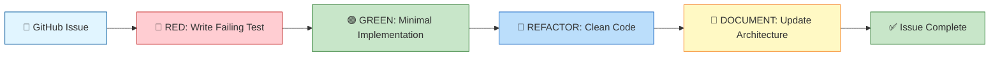

# 🎵 Sleep Audio Pipeline - Event-Driven Serverless Audio Processing

## 🔬 AI-Driven TDD Experiment


A production-ready, event-driven serverless AWS solution for processing audio files and text-to-speech content, built using **strict Test-Driven Development (TDD)** practices with AWS CDK (Python). This project serves as a comprehensive experiment in **TDD-first Infrastructure as Code (IaC)** and **pure issue-driven development**.

---

## 📋 Table of Contents

- [Overview](#overview)
- [🔬 Experiment Nature](#-experiment-nature)
- [Experiment Design](#experiment-design)
- [Architecture](#architecture)
- [Key Features](#key-features)
- [Quick Start](#quick-start)
- [Multi-Environment Deployment](#multi-environment-deployment)
- [Testing](#testing)
- [Project Structure](#project-structure)
- [Experiment Methodology](#experiment-methodology)
- [Cost Estimates](#cost-estimates)
- [Troubleshooting](#troubleshooting)
- [Documentation](#documentation)
- [Contributing](#contributing)
- [License](#license)
- [Experimental Results](#experimental-results)

---

## 🎯 Overview

The **Sleep Audio Pipeline** is a production-ready, serverless AWS solution for processing audio files for sleep and relaxation applications. This project serves as a **comprehensive experiment** in AI-assisted Test-Driven Development (TDD) for Infrastructure as Code (IaC).

### What Makes This Unique?

🤖 **Built with AI**: Developed in partnership with **Amazon Q Developer**  
🔴🟢🔵 **Strict TDD**: 108+ tests written **before** implementation (Red-Green-Refactor-Document)  
📝 **Issue-Driven**: 100% of work driven by GitHub Issues (#1-#17)  
📊 **Self-Graded**: Complete experimental report with honest assessment (see [FINAL-REPORT.md](FINAL-REPORT.md))  
🎯 **Production-Ready**: Full security, observability, and error handling from day one

---

## 🔬 Experiment Nature

> **This is a controlled experiment exploring whether AI agents can effectively collaborate on TDD Infrastructure as Code.**

### 🔬 Part of Experimental Series

This project is part of a larger **experimental series** exploring TDD Infrastructure as Code with AI agents:

| Dimension | This Experiment |
|-----------|-----------------|
| **Language** | Python 3.9+ with AWS CDK 2.x |
| **AI Agent** | Amazon Q Developer |
| **Methodology** | Strict TDD (Red-Green-Refactor-Document) |
| **Test Count** | 108+ tests (all passing) |
| **Issues Completed** | #1-#17 (100% issue-driven) |
| **Self-Grade** | ⭐⭐⭐⭐⭐ (5/5) - See [FINAL-REPORT.md](FINAL-REPORT.md) |

### 📊 Experimental Transparency

This project includes **complete experimental documentation** with honest self-assessment:

- **[EXPERIMENT.md](EXPERIMENT.md)** - Research questions, methodology, observations
- **[FINAL-REPORT.md](FINAL-REPORT.md)** - Comprehensive results with self-grading (⭐⭐⭐⭐⭐)
- **[ISSUE_15_REFLECTION.md](ISSUE_15_REFLECTION.md)** - Honest reflection on what worked and what didn't

**We invite you to review the evidence and draw your own conclusions about AI-assisted TDD for infrastructure.**

### Goals

1. **TDD-First IaC**: Every infrastructure component written test-first (Red-Green-Refactor-Document)
2. **Pure Issue-Driven**: All work driven by GitHub issues (#1-#12)
3. **Production-Ready**: Complete with error handling, observability, multi-environment support
4. **Reusable Patterns**: Extract meta-prompting and agent guidelines for future projects

### What Does It Do?

- 📥 **Accepts**: Audio files (`.mp3`, `.wav`, `.flac`, `.m4a`, `.ogg`) and text files (`.txt`)
- 🔄 **Processes**: Converts text to speech (Amazon Polly Neural TTS), validates file formats
- 📤 **Outputs**: Processed audio files with complete metadata tracking
- 📊 **Tracks**: DynamoDB metadata with status (PROCESSING → COMPLETED/FAILED)
- 📧 **Notifies**: SNS notifications for success/failure with detailed information
- 🔍 **Monitors**: CloudWatch Logs, X-Ray tracing, CloudWatch Alarms

---

## 🏗️ Architecture

## 🔄 TDD Workflow Visualization

This project follows **strict Test-Driven Development** for infrastructure:



**Result**: 108+ tests, 0 regressions, production-ready infrastructure.

---

The pipeline follows an event-driven architecture orchestrated by AWS Step Functions:

```
S3 Upload → EventBridge → Step Functions → Lambda → Polly → S3 Output
                              ↓
                          DynamoDB (Metadata)
                              ↓
                          SNS (Notifications)
```

### AWS Services Used

- **Amazon S3**: Input/output storage with versioning and encryption
- **Amazon EventBridge**: Decoupled event routing from S3 to Step Functions
- **AWS Step Functions**: Orchestration with visual workflows and built-in error handling
- **AWS Lambda**: Python 3.12 function for validation and audio processing
- **Amazon Polly**: Neural TTS for text-to-speech conversion (Joanna voice)
- **Amazon DynamoDB**: Metadata tracking with on-demand billing
- **Amazon SNS**: Encrypted notifications (success/failure topics)
- **Amazon CloudWatch**: Logs, alarms, and distributed tracing (X-Ray)

For detailed architecture diagrams and service rationale, see **[ARCHITECTURE.md](ARCHITECTURE.md)**.

---

## ✨ Key Features

### Production-Ready Infrastructure
- ✅ **Encryption at Rest**: S3 (SSE-S3), DynamoDB (AWS managed), SNS (KMS)
- ✅ **Error Handling**: Comprehensive catch blocks in Step Functions
- ✅ **Retry Policies**: Exponential backoff (2.0 rate) for transient failures
- ✅ **Least Privilege IAM**: Minimal permissions for all roles
- ✅ **Multi-Environment**: Dev/stage/prod configurations via CDK context

### Observability
- 📊 **CloudWatch Logs**: Structured JSON logging with request IDs
- 🔍 **X-Ray Tracing**: End-to-end distributed tracing (environment-specific)
- 🚨 **CloudWatch Alarms**: State machine failures, Lambda errors → SNS

### Development Excellence
- 🧪 **82+ Tests**: Complete infrastructure test coverage with CDK assertions
- 🔴🟢🔵 **Strict TDD**: Every component test-first (Red-Green-Refactor-Document)
- 📝 **Living Documentation**: ARCHITECTURE.md synchronized with code on every change
- 🤖 **AI-Friendly**: Meta-prompts and agent guidelines for Q Developer / Copilot

---

## 🚀 Quick Start

### Prerequisites

- **Python 3.9+** (tested on 3.9, 3.10, 3.11, 3.12)
- **Node.js 18+** (for AWS CDK CLI)
- **AWS CLI configured** with credentials
- **AWS Account** with CDK bootstrapped

### Installation

```bash
# Clone the repository
git clone https://github.com/yourusername/cdk-sleep-py-qdev.git
cd cdk-sleep-py-qdev

# Create virtual environment
python -m venv .venv
source .venv/bin/activate  # On Windows: .venv\Scripts\activate

# Install dependencies
pip install -r requirements.txt
pip install -r requirements-dev.txt

# Install AWS CDK CLI
npm install -g aws-cdk
```

### Bootstrap CDK (First Time Only)

```bash
# Bootstrap CDK in your AWS account/region
cdk bootstrap aws://ACCOUNT-NUMBER/REGION
```

### Synthesize CloudFormation Template

```bash
# Default environment (dev)
cdk synth

# Specific environment
cdk synth --context env=dev
cdk synth --context env=stage
cdk synth --context env=prod
```

### Deploy

```bash
# Deploy to development
cdk deploy --context env=dev

# Deploy to staging (requires approval)
cdk deploy --context env=stage

# Deploy to production (requires approval)
cdk deploy --context env=prod --require-approval broadening
```

### Verify Deployment

1. Check AWS CloudFormation console for stack creation
2. Upload a test file to the input S3 bucket
3. Monitor Step Functions execution in AWS console
4. Check DynamoDB table for metadata record
5. Verify output file appears in output S3 bucket
6. Check SNS for success notification

---

## 🌍 Multi-Environment Deployment

The project supports three environments with distinct configurations:

| Environment | Log Retention | X-Ray Tracing | Use Case |
|-------------|---------------|---------------|----------|
| **dev**     | 7 days        | ❌ Disabled    | Local development, experimentation |
| **stage**   | 30 days       | ✅ Enabled     | Pre-production testing, prod-like config |
| **prod**    | 90 days       | ✅ Enabled     | Live customer-facing environment |

All resources are named with environment suffix (e.g., `SleepAudioInputBucketDev`).

---

## 🧪 Testing

### Run All Tests

```bash
# Run pytest with coverage
pytest tests/ -v --cov=cdk_base --cov-report=term-missing

# Run tests for specific issue
pytest tests/unit/test_cdk_base_stack.py::test_lambda_function_exists -v
```
- **108+ tests** across all issues (infrastructure + Lambda unit tests)
### Test Coverage

- **82+ tests** across 12 issues
- **Fine-grained assertions** for IAM policies, resource properties, state machine definitions
- **Snapshot tests** for catching unexpected changes
- **End-to-end validation** tests for complete pipeline flow

### CI/CD

GitHub Actions automatically runs tests on every push/PR:
- Pytest across Python 3.9, 3.10, 3.11, 3.12
- CDK synth for all environments (dev, stage, prod)
- Linting checks (can be extended with black, flake8, mypy)

See **[.github/workflows/ci.yml](.github/workflows/ci.yml)** for CI configuration.

---

## 📁 Project Structure

```
cdk-sleep-py-qdev/
├── cdk_base/                    # CDK stack definitions
│   ├── cdk_base_stack.py        # Main infrastructure stack
│   └── deployment_pipeline_stack.py  # CDK Pipeline (skeleton)
├── lambda/                      # Lambda function code
│   └── audio_processor/
│       └── handler.py           # Audio processing logic
├── tests/                       # Test suite (82+ tests)
│   └── unit/
│       └── test_cdk_base_stack.py
├── app.py                       # CDK app entry point
├── cdk.json                     # CDK configuration
├── ARCHITECTURE.md              # 📘 Technical architecture (source of truth)
├── AGENT_GUIDELINES.md          # 🤖 Agent/developer guidelines
├── SUMMARY.md                   # 📋 Project summary and completion notes
├── META-PROMPTS.md              # 🧠 Reusable meta-prompting patterns
├── EXPERIMENT.md                # 🔬 Experiment design document
└── README.md                    # 📖 This file
```

---

## 🧪 Experiment Methodology

For detailed experimental results and self-assessment, see **[FINAL-REPORT.md](FINAL-REPORT.md)**.

This project serves as a comprehensive experiment in **TDD-first Infrastructure as Code**. Key learnings:

### TDD Workflow (Red-Green-Refactor-Document)

1. **🔴 RED**: Write failing CDK assertion tests first
2. **🟢 GREEN**: Implement minimal infrastructure to pass tests
3. **🔵 REFACTOR**: Clean up code, extract patterns, optimize
4. **📝 DOCUMENT**: Update ARCHITECTURE.md, sync diagrams

### Pure Issue-Driven Development

- **Every feature** starts with a GitHub issue (#1-#12)
- **Every issue** follows strict TDD cycle
- **Every PR** includes tests and documentation updates
- **No code** written before tests (discipline enforced)

### Reusable Patterns

The **[META-PROMPTS.md](META-PROMPTS.md)** file extracts reusable patterns for:
- AI agents (Q Developer, GitHub Copilot)
- TDD IaC workflows
- Issue-driven development
- Documentation synchronization

### Experiment Design Document

---

## 💰 Cost Estimates

### Monthly Cost Breakdown (10,000 audio files/month, avg 5MB each)

| Service | Usage | Estimated Cost |
|---------|-------|----------------|
| **S3** | 50GB stored, 10K PUT, 20K GET | $1.21 |
| **EventBridge** | 10K events | $0.00 (free tier) |
| **Step Functions** | 10K executions, 5 states avg | $1.25 |
| **Lambda** | 10K invocations, 30K GB-sec | $0.60 |
| **Polly** | 1M characters (100 text files) | $16.00 |
| **DynamoDB** | On-demand, 30K writes, 100K reads | $3.00 |
| **SNS** | 10K notifications | $0.50 |
| **CloudWatch** | 5GB logs, 10 custom metrics | $5.50 |
| **Total** | | **~$28/month** |

### Cost Optimization Tips

- ✅ Use S3 lifecycle policies to transition to cheaper storage tiers
- ✅ DynamoDB on-demand suitable for unpredictable workloads
- ✅ X-Ray disabled in dev environment saves costs
- ✅ Shorter log retention in dev (7 days vs 90 days in prod)
- ✅ Consider provisioned capacity if traffic becomes predictable

---

## 🔧 Troubleshooting

### Common Issues

#### 1. CDK Bootstrap Error
**Issue**: `CDKToolkit stack not found`  
**Solution**:
```bash
cdk bootstrap aws://ACCOUNT-NUMBER/REGION
```

#### 2. Lambda Timeout on Large Files
**Issue**: Lambda times out processing large audio files  
**Solution**: Lambda timeout is set to 300 seconds (5 minutes). For larger files, increase timeout in `cdk_base_stack.py`:
```python
timeout=Duration.seconds(600)  # 10 minutes
```

#### 3. Step Functions Execution Fails
**Issue**: State machine execution shows failure  
**Solution**:
- Check CloudWatch Logs: `/aws/stepfunctions/sleep-audio-pipeline`
- Review DynamoDB table for error messages
- Check SNS failed topic for error details
- Verify IAM permissions are correct

#### 4. S3 Upload Doesn't Trigger Pipeline
**Issue**: File uploaded to S3 but no state machine execution  
**Solution**:
- Verify EventBridge is enabled on S3 bucket
- Check EventBridge rule is enabled
- Verify file is uploaded to correct bucket (input, not output)
- Check CloudWatch Logs: `/aws/events/sleep-audio-pipeline`

#### 5. DynamoDB Record Not Created
**Issue**: No metadata record in DynamoDB  
**Solution**:
- State machine may have failed before DynamoDB task
- Check CloudWatch Logs for state machine execution errors
- Verify DynamoDB table name matches environment variable

### Debugging Tips

1. **Enable X-Ray** in dev for detailed tracing: Set `enable_xray: true` in `cdk.json`
2. **Check CloudWatch Logs** for each component:
   - State Machine: `/aws/stepfunctions/sleep-audio-pipeline`
   - EventBridge: `/aws/events/sleep-audio-pipeline`
   - Lambda: `/aws/lambda/SleepAudioProcessor`
3. **Review State Machine Execution** in AWS console for visual workflow
4. **Check DynamoDB Table** for status and error messages
5. **Subscribe to SNS Topics** for real-time error notifications

---

## 📚 Documentation

This project includes comprehensive documentation:

| **[README.md](README.md)** | 📖 This file - comprehensive project overview and quick start |
| **[FINAL-REPORT.md](FINAL-REPORT.md)** | 📊 Complete experimental results with self-grading (⭐⭐⭐⭐⭐ 5/5) |
|----------|-------------|
| **[README.md](README.md)** | 📖 This file - project overview and quick start |
| **[SUMMARY.md](SUMMARY.md)** | 📋 Project completion summary, key decisions, deployment readiness checklist |
| **[SUMMARY.md](SUMMARY.md)** | 📋 Project summary, key decisions, deployment readiness checklist |
| **[META-PROMPTS.md](META-PROMPTS.md)** | 🧠 Reusable meta-prompting patterns for future TDD IaC projects |
| **[.github/workflows/ci.yml](.github/workflows/ci.yml)** | ⚙️ CI/CD pipeline configuration |

### Reading Order for New Contributors
1. **README.md** (this file) - Start here for project overview
6. **SUMMARY.md** - Review project completion and key learnings
4. **META-PROMPTS.md** - Discover reusable patterns for AI-assisted development
5. **SUMMARY.md** - Review project completion and key learnings

---

## 🤝 Contributing

This project was built as a TDD IaC experiment and is now complete. However, contributions are welcome for:

- Bug fixes
- Documentation improvements
- Additional test coverage
- Cost optimization suggestions
- New feature proposals (should follow strict TDD)

### Contribution Guidelines

1. **Read [AGENT_GUIDELINES.md](AGENT_GUIDELINES.md)** for development standards
2. **Create a GitHub issue** describing the proposed change
3. **Write tests first** (Red-Green-Refactor-Document)
4. **Update ARCHITECTURE.md** if changing infrastructure
5. **Ensure all tests pass** and CI is green
6. **Submit a PR** with issue reference

---

## 📄 License

---

## 📊 Experimental Results

### Final Assessment

This experiment has been **self-graded** with complete transparency:

**Overall Rating**: ⭐⭐⭐⭐⭐ (5/5) - Highly Successful

- ✅ **TDD Discipline**: 108+ tests written test-first, 0 regressions
- ✅ **AI Collaboration**: Effective with proper prompting and guidelines
- ✅ **Production Ready**: Complete security, observability, error handling
- ✅ **Documentation**: 100% synchronized throughout all 17 issues

**Read the full experimental report**: [FINAL-REPORT.md](FINAL-REPORT.md)

We encourage you to review the evidence and form your own assessment of AI-assisted TDD for Infrastructure as Code.

This project is licensed under the MIT License - see the [LICENSE](LICENSE) file for details.

**Developed in partnership with Amazon Q Developer** (Issues #1-#17)  
**Project Status**: ✅ Complete - Production Ready
**Developed in partnership with Amazon Q Developer for Issues #1-#14**
**Developed in partnership with Q Developer for Issues #1-#13**
